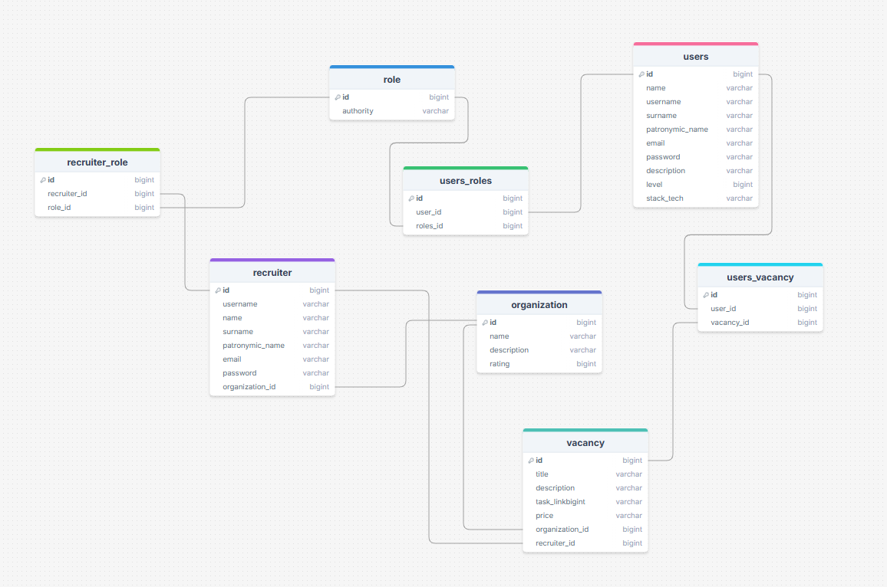
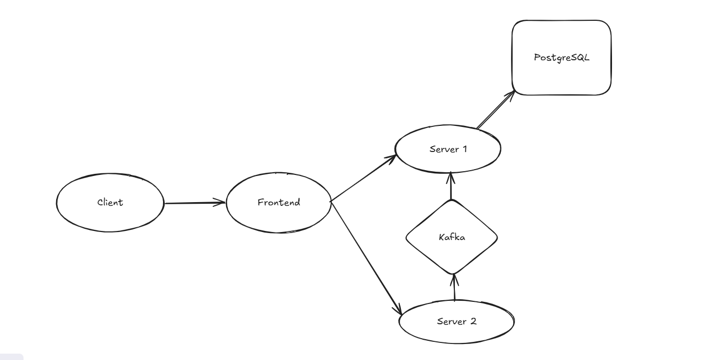

=======

# FindIT
## О проекте
#### FindIT - это удобное приложение для поиска работы в сфере IT.
* Наше приложение помогает отбирать пользователей для работы,путем проверки их знаний на практике.
* За каждый пройденное задание пользователь получает баллы в свой уровень.
* Таким образом оно поможет работодателям искать работников с определенными и проверенными навыками.
#### Особенности нашего приложения:
* Есть система проверки навыков.
* Работодатели могут выкладывать свои задания для кандидатов на работу.
* Также у пользователей и организаций есть уровни, благодаря которым можно проводить качественный отбор кандидатов для организаций.

## Инструкция к запуску
#### 1. Скопируйте репозиторий - https://github.com/UntitledTeamWithoutGmo/find_it_docker комадной ``` git clone ```
#### 2. Запустите приложение командой ``` docker compoose up --build ```
#### 3. После запуска перейдите на ` localhost:6001/main-page`
## ВАЖНО - на странице с регистрацией делать надежный пароль

## Техническая часть
### Схема базы данных(PostgreSQL) основного сервиса

#### https://drawsql.app/teams/-3620/diagrams/findit
### Схема прилоложения

#### https://excalidraw.com/#json=0IZVSFqW1XHYGAB1pRlVN,AaNIE62B-3zmvzH-5_-PTA
#### Приложение делится на серверную, клиентскую и веб части.
### Серверная часть(HTTP)
Взаимодействие с данной частью осуществляется по HTTP протоколу при помощи архитектуры REST API.

### Стек технологий
* Spring Framework: Spring boot, Spring Security
* Hibernate
* PostgreSQL
* Kafka
* Docker
* Vite
* React
* Figma
* ...
### Начало работы
...
## Разработчики и контрибьюторы:
* Dnr0v3c - тимлид(backend-разработчик) -> https://github.com/Dnr0v3c
* GoNazarShan - backend-разработчик -> https://github.com/GoNazarShan
* TeRrAiSt28 - frontend-разработчик -> https://github.com/TeRrAiSt28
* DivineIntellect88 - UI/UX дизайнер -> https://github.com/DivineIntellect88

## UI/UX дизайн в Figma
* https://www.figma.com/design/DoR3vGxJL5vxQWQyNk3FLh/FindIt?node-id=1-7&t=5dsp3taPcLPakPky-0
## Docker images
* основной сервис - https://hub.docker.com/r/korolshutov/find_it_back_main_45
* микросервис для компиляции и проверки кода - https://hub.docker.com/r/korolshutov/find_it_back_code_8
* frontend - https://hub.docker.com/r/korolshutov/find_it_frontend_3
## Repositories 
* frontend - https://github.com/UntitledTeamWithoutGmo/FindIT_front_web/tree/yura
* backend(основной сервис) - https://github.com/UntitledTeamWithoutGmo/FindIT_back_java
* backend( микросервис для компиляции и проверки кода ) - https://github.com/UntitledTeamWithoutGmo/find_it_back_java_code_test
## P.S
#### Данный проект немного не доделан и создавался для учебного проекта .Проект не имеет даже статуса MVP,а просто воплощает идею.